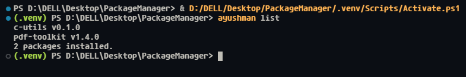

# AyushMan


**AyushMan** is a minimal, Windows-only binary installer for ZIP-based GitHub releases from [author](https://github.com/JourneyCodesAyush)’s repositories.

> Installs prebuilt, versioned Windows binaries from the [author](https://github.com/JourneyCodesAyush)’s GitHub releases, safely and with minimal fuss.

It installs prebuilt executables directly from GitHub and keeps them isolated,
versioned, and upgrade-safe.

> [!WARNING]
> `AyushMan` is **NOT** a general-purpose package manager.

---

## Quick Start

```powershell
git clone https://github.com/JourneyCodesAyush/ayushman.git
cd ayushman

python -m venv .venv
.\.venv\Scripts\Activate.ps1
# For CMD, use: .venv\Scripts\activate.bat

pip install -r requirements.txt

# Install a package
python -m ayushman.__main__ install pdf-toolkit
pdf-toolkit --help
```

> Works on Windows 10+ (x86_64). All installed executables live in `~/.ayushman/bin`.

---

## Features

- Windows-only (Windows 10+, x86_64)
- Installs **prebuilt executables** from GitHub release ZIPs
- Extracts **only `.exe` files**
- Uses **hard links** for upgrade-safe installs
- Keeps packages versioned and isolated
- Supports `install`, `list`, `upgrade`, and `uninstall` commands
- Minimal global state with JSON metadata
- No build steps, scripts, or installers

---

## Supported platforms

- Windows 10 / 11 (x86_64)
- Windows-only by design

---

## Installation

> [!NOTE]
> Currently, `ayushman` runs as a Python module (`python -m ayushman.__main__`).
> No standalone executable is provided yet.

To install and run `ayushman` locally:

1. Clone the repository:

   ```bash
   git clone https://github.com/JourneyCodesAyush/ayushman.git
   cd ayushman
   ```

2. (Recommended) Create and activate a virtual environment:

   ```ps1
   python -m venv .venv

   # On Windows CMD:
   .venv\Scripts\activate.bat

   # On Windows PowerShell:
   .\.venv\Scripts\Activate.ps1
   ```

3. Install dependencies:

   ```bash
   pip install -r requirements.txt
   ```

---

## Development / Editable Install

To install `ayushman` as a local command for development:

```powershell
python -m venv .venv
.\.venv\Scripts\Activate.ps1  # PowerShell

pip install -e .

ayushman list
```

Notes:

- Editable mode (`-e`) makes your source code changes immediately available without reinstalling.
- Make sure the virtual environment is activated; otherwise, `ayushman` won’t be on PATH.
- After the first install, `~/.ayushman/bin` is automatically added to the **user PATH** so all installed binaries work in new terminals.

---

## Usage

See all available commands using `-h` or `--help` flags:

> [!NOTE]
> Either use `python -m ayushman.__main__` or use `ayushman` as mentioned in the previous section

<p align="center">
  
  <br>
</p>

Example output of `ayushman list`

Commands

```bash
python -m ayushman.__main__ install pdf-toolkit
python -m ayushman.__main__ list
python -m ayushman.__main__ upgrade pdf-toolkit
python -m ayushman.__main__ uninstall pdf-toolkit
```

---

## Installation directory layout

All ayushman data is stored in `~/.ayushman/`.

> The `ayushman` executable itself can live anywhere.
> No executable is provided so far for `AyushMan` itself

```text
~/.ayushman/
├── bin/
│   └── <pkg>.exe               # hard-linked executable
├── packages/
│   └── <pkg>/
│       └── <version>/
│           ├── <pkg>.exe
│           └── metadata.json   # package registry
└── metadata.json               # global registry
```

- `packages/` contains versioned, original executables
- `bin/` exposes the active version via hard links
- Global metadata references per-package metadata files

---

## PATH handling

Executables are exposed via `~/.ayushman/bin`.

```powershell
# Verify that ~/.ayushman/bin is in your PATH
echo $env:PATH
# If not present, restart your terminal or re-login to see the updated PATH
```

> [!NOTE]
> `~/.ayushman/bin` is automatically added to the **user PATH** on first run.
> This makes installed executables immediately available in new terminal sessions,
> without modifying system-level PATH variables.

---

## Package source & constraints

- Packages are downloaded **only** from this [author](https://github.com/JourneyCodesAyush)’s repositories
- The **latest release** is selected automatically
- ZIP assets must contain **binaries only**
- No scripts, installers, or post-install hooks are executed
- Packages are expected to ship ready-to-run executables

---

## Commands

All commands are run using `python -m ayushman.__main__`:

```bash
python -m ayushman.__main__ install pdf-toolkit
python -m ayushman.__main__ list
python -m ayushman.__main__ upgrade pdf-toolkit
python -m ayushman.__main__ uninstall pdf-toolkit
```

All operations are safe to re-run and designed to be idempotent.

> [!TIP]
> After adding `~/.ayushman/bin` to PATH, all installed executables behave like any other CLI tool.

---

## Scope

AyushMan is intentionally small in scope:

- No dependency resolution
- No source builds
- No cross-platform support
- No package ecosystem or central registry

AyushMan is designed for installing **trusted prebuilt Windows binaries** - not for managing software ecosystems.

---

## Philosophy

AyushMan focuses on **safe, versioned, prebuilt Windows binaries**.
No builds, no scripts, no cross-platform headaches — just install, run, and upgrade.

For a deeper explanation of why `AyushMan` works this way, its design principles, and the [author](https://github.com/JourneyCodesAyush)’s philosophy on package management, see [PHILOSOPHY.md](PHILOSOPHY.md).

---

## License

This project is licensed under the [**MIT License**](./LICENSE).

You’re free to use, modify, and distribute it.

> [!TIP]
> A tag or mention of [JourneyCodesAyush](https://github.com/JourneyCodesAyush) is always appreciated.
