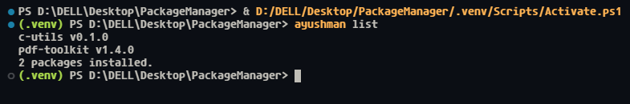

# AyushMan


**AyushMan** is a minimal, Windows-only binary installer for ZIP-based GitHub releases from [author](https://github.com/JourneyCodesAyush)'s repositories.

> Installs prebuilt, versioned Windows binaries from the [author](https://github.com/JourneyCodesAyush)'s GitHub releases, safely and with minimal fuss.

It installs prebuilt executables directly from GitHub and keeps them isolated,
versioned, and upgrade-safe.

**AyushMan is designed to be fork-friendly.**
Project-specific configuration such as the GitHub release owner and installation layout can be customized from `src/ayushman/constants.py`.

See [Forking & Configuration](#forking--configuration) for details.

> [!WARNING]
> `AyushMan` is **NOT** a general-purpose package manager.

---

## Requirements

- Windows 10 / 11 (x86_64)

---

## Quick Start

1. Download `ayushman-windows-x86_64.zip` from the [latest release](https://github.com/JourneyCodesAyush/ayushman/releases/latest)
2. Extract it anywhere — you'll get `ayushman.exe`
3. Run:

```powershell
.\ayushman.exe install ayushman
```

That's it. `ayushman` is now installed globally and manages itself from here on.

```powershell
ayushman install pdf-toolkit
pdf-toolkit --help
```

> All installed executables live in `%LOCALAPPDATA%\.ayushman\bin`, which is added to your PATH automatically on first install. Restart your terminal if the command isn't found immediately.

---

## Features

- Windows-only (Windows 10+, x86_64)
- Installs **prebuilt executables** from GitHub release ZIPs
- Extracts **only `.exe` files**
- Uses **hard links** for upgrade-safe installs
- Keeps packages versioned and isolated
- Supports `install`, `list`, `upgrade`, `uninstall`, `info`, and `purge` commands
- Minimal global state with JSON metadata
- No build steps, scripts, or installers
- Bootstrapped — installs and upgrades itself

---

## Supported platforms

- Windows 10 / 11 (x86_64)
- Windows-only by design

---

## Installation

### Bootstrapped (recommended)

Download the latest `ayushman-windows-x86_64.zip` from the [releases page](https://github.com/JourneyCodesAyush/ayushman/releases/latest), extract it, and run:

```powershell
.\ayushman.exe install ayushman
```

AyushMan installs itself into `%LOCALAPPDATA%\.ayushman\bin` and patches your PATH. From this point, use `ayushman` globally from any terminal.

To upgrade AyushMan itself later:

```powershell
ayushman upgrade ayushman
```

### From source (for development)

Requires Python 3.11+ and [uv](https://github.com/astral-sh/uv).

```powershell
git clone https://github.com/JourneyCodesAyush/ayushman.git
cd ayushman

uv venv .venv --clear
.\.venv\Scripts\Activate.ps1  # PowerShell
# For CMD: .venv\Scripts\activate.bat

uv sync
uv pip install -e . --link-mode=copy

ayushman list
```

Notes:

- Editable mode (`-e`) makes your source code changes immediately available without reinstalling.
- Make sure the virtual environment is activated; otherwise, `ayushman` won't be on PATH.

---

## Forking & Configuration

AyushMan is designed to be easy to fork.

Project-specific configuration is kept in `src/ayushman/constants.py`, allowing forks to customize where packages are downloaded from and how they are installed.

Available configuration options include:

- `GITHUB_OWNER` – GitHub account or organization used to fetch releases
- `INSTALL_DIR_NAME` – local application directory name
- `PACKAGE_DIR_NAME` – package storage directory name
- `BIN_DIR_NAME` – executable directory name
- `METADATA_FILE_NAME` – metadata file name

Forks can also customize the list of installable packages by editing:

```text
src/ayushman/registry_supported.py
```

The `SUPPORTED_PACKAGES` registry defines the packages shown by `ayushman available`.

You can:

- Add new packages
- Remove packages you don't distribute
- Update package descriptions

Example:

```python
SUPPORTED_PACKAGES = {
    "my-tool": {
        "description": "A useful command-line utility",
    },
}
```

Changing both `constants.py` and `registry_supported.py` allows a fork to use its own GitHub release repositories, package catalog, and installation layout without modifying AyushMan's core logic.

---

## Usage

See all available commands using `-h` or `--help` flags:

<p align="center">
  
  <br>
</p>

Example output of `ayushman list`

Commands

```bash
ayushman install pdf-toolkit
ayushman list
ayushman available
ayushman upgrade pdf-toolkit
ayushman uninstall pdf-toolkit
```

> [!TIP]
> Use `available` to see all packages currently supported by AyushMan.

## Available Packages

AyushMan provides a curated list of packages that can be installed directly.
This avoids the need to browse GitHub manually.

For forks, this list is defined in `src/ayushman/registry_supported.py` and can be customized to match your own GitHub releases.

```bash
ayushman available
```

```txt
Available packages:

  occ          -  The Optimistic Compiler Collection - because every program deserves to succeed
  lsz          -  ls in Zig
  sweep        -  Recursively find and delete unwanted folders like node_modules
  c-utils      -  Linux utilities commands rewritten for educational purposes
  cpp-cloc     -  Count lines of code for various languages
  passman      -  A local-first CLI password manager
  ayushman     -  The AyushMan package manager itself
  mklicense    -  Generate license files for your projects from the command line
  pdf-toolkit  -  PDF manipulation utilities
```

---

## Installation directory layout

All ayushman data is stored in `%LOCALAPPDATA%\.ayushman\`.

```text
%LOCALAPPDATA%\.ayushman\
├── bin/
│   └── <pkg>.exe               # hard-linked executable
├── packages/
│   └── <pkg>/
│       └── <version>/
│           ├── <pkg>.exe
│           └── metadata.json   # package registry
└── metadata.json               # global registry
```

- `packages/` contains versioned, original executables
- `bin/` exposes the active version via hard links
- Global metadata references per-package metadata files

---

## PATH handling

Executables are exposed via `%LOCALAPPDATA%\.ayushman\bin`.

```powershell
# Verify that %LOCALAPPDATA%\.ayushman\bin is in your PATH
echo $env:PATH
# If not present, restart your terminal or re-login to see the updated PATH
```

AyushMan attempts to add: `%LOCALAPPDATA%\.ayushman\bin` to the user PATH on first run.

If the change does not take effect immediately, restart your terminal or re-login.

> This allows installed executables to be used globally from any terminal session.

> [!NOTE]
> If automatic PATH injection fails, manually add %LOCALAPPDATA%\.ayushman\bin to User Environment Variables.

---

## Package source & constraints

- Packages are downloaded **only** from this [author](https://github.com/JourneyCodesAyush)'s repositories
- The **latest release** is selected automatically
- ZIP assets must contain **binaries**
- No scripts, installers, or post-install hooks are executed
- Packages are expected to ship ready-to-run executables

---

## Commands

All commands are run using `ayushman`:

```bash
ayushman install pdf-toolkit
ayushman list
ayushman upgrade pdf-toolkit
ayushman uninstall pdf-toolkit
```

> [!WARNING]
> Danger zone ahead

> Remove 'AyushMan' from your system

```bash
ayushman purge
ayushman purge --dry-run # simulate without making changes
ayushman purge --force # skip confirmation prompt
```

All operations are safe to re-run and designed to be idempotent.

> [!TIP]
> After adding `%LOCALAPPDATA%\.ayushman\bin` to PATH, all installed executables behave like any other CLI tool.

---

## Scope

AyushMan is intentionally small in scope:

- No dependency resolution
- No source builds
- No cross-platform support
- No package ecosystem or central registry

AyushMan is designed for installing **trusted prebuilt Windows binaries** - not for managing software ecosystems.

---

## Philosophy

AyushMan focuses on **safe, versioned, prebuilt Windows binaries**.
No builds, no installers, no cross-platform abstraction — just install, run, and upgrade.

For a deeper explanation of why `AyushMan` works this way, its design principles, and the [author](https://github.com/JourneyCodesAyush)'s philosophy on package management, see [PHILOSOPHY.md](PHILOSOPHY.md).

---

## License

This project is licensed under the [**MIT License**](./LICENSE).

You're free to use, modify, and distribute it.

> [!TIP]
> A tag or mention of [JourneyCodesAyush](https://github.com/JourneyCodesAyush) is always appreciated.
